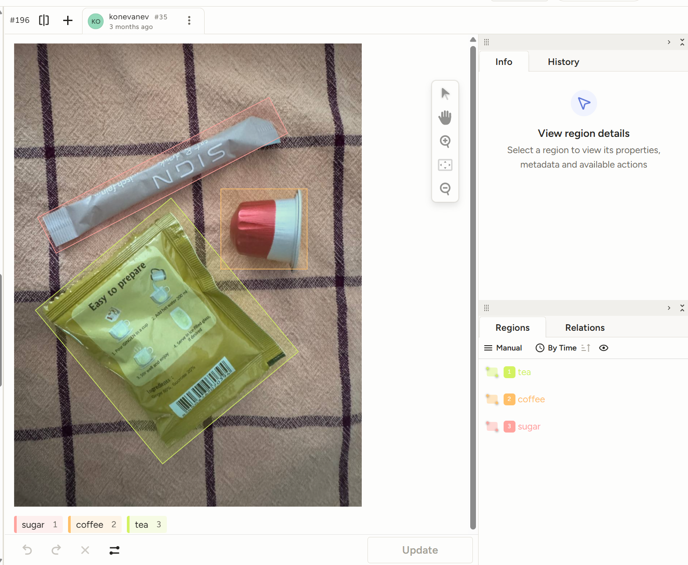
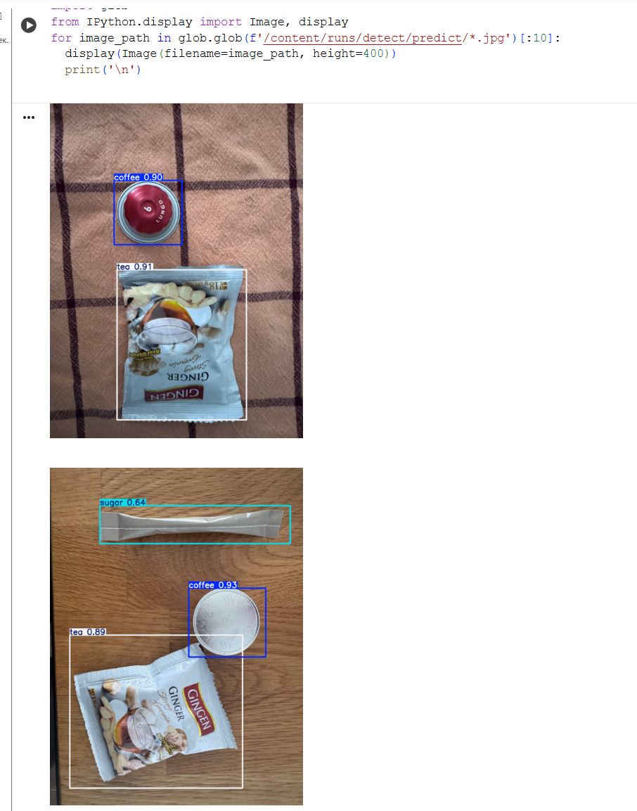

# 🧠 YOLO Drink Prep Detector  

[](https://colab.research.google.com/github/YOUR_USERNAME/YOUR_REPO_NAME/blob/main/Train_YOLO_Models.ipynb)

Train and deploy a custom **YOLO-based real-time object detection model** for identifying ingredients used in drink preparation — specifically **coffee**, **tea**, and **sugar**.  
This repository combines a **Google Colab training pipeline** with a **real-time detection overlay** implemented in Python.

---

## 📂 Repository Structure  

| File | Description |
|------|--------------|
| **`Train_YOLO_Models.ipynb`** | Google Colab notebook adapted from [Evan Juras – Train and Deploy YOLO Models](https://github.com/EdjeElectronics/Train-and-Deploy-YOLO-Models). Provides a full workflow for dataset preparation, YOLO training, and validation using Ultralytics. |
| **`Yolo_Trade_AI.py`** | Real-time screen detection script that continuously captures your screen, performs YOLO inference, and displays results via a transparent PyQt5 overlay (detecting coffee, tea, and sugar). |
| **`dataset_drink_v2.zip`** | Custom dataset labeled using [Label Studio](https://labelstud.io/?utm_source=youtube&utm_medium=video&utm_campaign=edjeelectronics). Used for model training. |

---

## 🚀 Features  

- 🔹 **End-to-end YOLO workflow:** from labeling to live detection  
- ⚙️ **Colab-ready:** GPU acceleration and quick setup  
- 🧩 **Custom classes:** trained to detect `coffee`, `sugar`, and `tea`  
- 🖥️ **Transparent overlay:** real-time results on top of any window  
- 📈 **Performance metrics:** live FPS counter and confidence labels  

---

## 🧠 Training Example  

The dataset was labelled in Label Studio:



Run the following command inside Colab to train the model:
```bash
!yolo detect train data=/content/data.yaml model=yolo11s.pt epochs=60 imgsz=640
```

The best weights will be saved at:

`/content/runs/detect/train/weights/best.pt`

### 🧪 Example Validation Results

| Class  | Precision | Recall | mAP@50 | mAP@50–95 |
|:-------|:-----------|:--------|:--------|:-----------|
| **coffee** | 0.99 | 0.92 | 0.99 | 0.72 |
| **sugar**  | 0.97 | 1.00 | 0.99 | 0.69 |
| **tea**    | 0.96 | 1.00 | 0.99 | 0.88 |


---

After training, the model is tested on the validation dataset.  
Below is an example of the detection results:

<p align="center">
  
</p>

---

### 🖥️ Real-Time Inference

To run detection locally:
```bash
python Yolo_Trade_AI.py
```


Press `q` to close the overlay window.
The script uses:


`mss` → for real-time screen capture


`PyQt5` → for the transparent overlay


`Ultralytics` YOLO → for object detection


🧰 Requirements
Install dependencies before running locally:
```pip install ultralytics mss opencv-python pyqt5 pynput```


📜 Credits

**Base training framework**: Evan Juras (EJ Technology Consultants)

**Adaptation, dataset**: Nataliia Koneva
